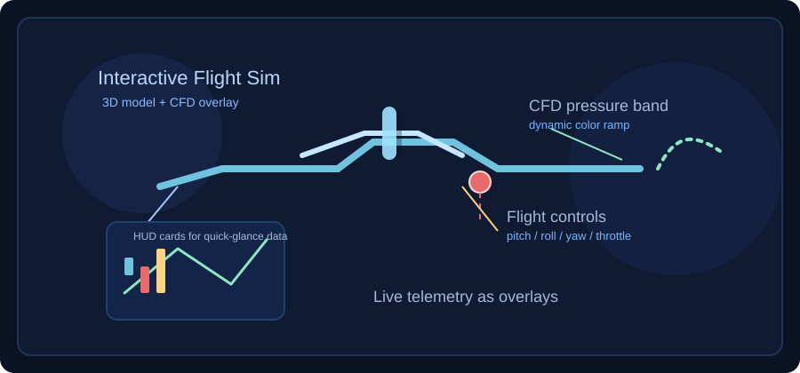
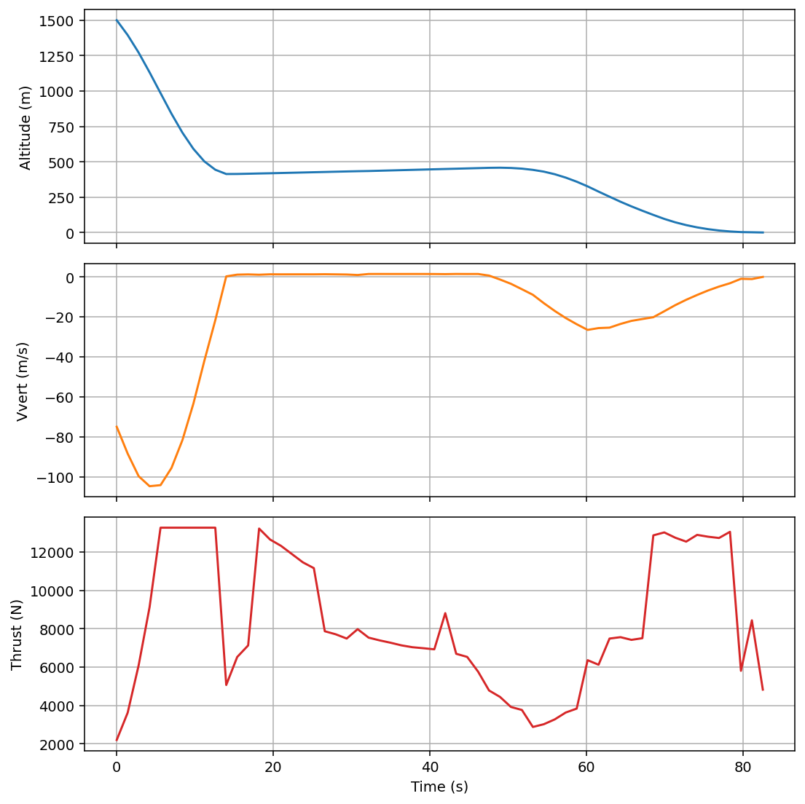
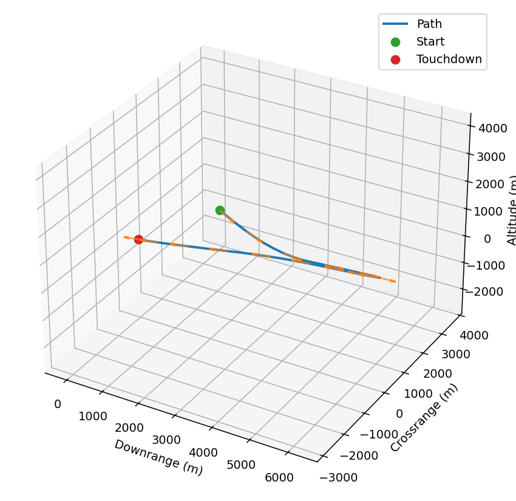

# Interactive Resume & Engineering Portfolio

This repo powers my interactive resume site:
- **Experience & tools**: Dassault/Safran/Boeing engagements using C++, VBScript, EKL, shell across Cameo, CATIA/3DEXPERIENCE, SIMULIA.
- **Interactive demos**: Requirements/MBSE viewer, digital twin, turbofan acoustics/performance, RL flight control research, and a new Mars lander guidance sandbox.
- **Education**: Wichita State (M.S. turbofan takeoff acoustics; flight control + propulsion + acoustics) and UT Arlington (M.Eng. composites + GNC).

Featured builds in the portfolio:
- **Digital Twin Flight Simulator**: Real-time CFD-backed aircraft sandbox in the browser.
- **Mars Lander Optimal Guidance**: Fuel-minimizing powered-descent solver with animated 3D trajectories.

Below are highlights, visuals, and usage notes for the featured simulations.

## Visual Gallery






Add your own captures (STEP renders, CFD overlays, lander plots) by dropping PNG/SVGs into `docs/images/` and extending the gallery above.
Run `python src/MarsLander.py` to regenerate the lander figures; they export into `docs/images/` automatically.

## Digital Twin Flight Simulator

### 🛩️ Flight Simulation
- **Interactive Flight Simulator**: Real-time 3D flight dynamics with full 6-DOF control
- **Flight Modes**: Cruise, climb, descent, turns with automatic trimming
- **3D Model**: 74-component Udaan aircraft loaded from STEP file via WebAssembly
- **Component Highlighting**: Interactive selection of aircraft components with naming

### 🌊 CFD & Aerodynamics
- **Real-time CFD**: Aerodynamic coefficient calculation at 60 FPS
- **Pressure Visualization**: Color-coded pressure field display (blue = suction, red = pressure)
- **Flight HUD**: Live aerodynamic state overlays (stall margin, turn performance, trim) without the heavy data tables
- **Stall Warning System**: Real-time stall detection with visual alerts
- **Performance Envelope**: Calculated based on aircraft mass, wing area, and aerodynamic properties

### 🎨 3D Visualization
- **STEP File Rendering**: WebAssembly-based CATIA geometry import and rendering with Three.js
- **Propeller Animation**: Real-time propeller rotation based on throttle
- **Flight Controls**: Interactive sliders for pitch, roll, yaw, and throttle
- **Camera Control**: Orbit controls with resetable view

## Project Structure

```
kush-resume/
├── README.md                          # This file - main documentation
├── src/
│   ├── MarsLander.py                  # Fuel-optimal powered-descent solver (Python)
│   ├── components/
│   │   ├── StepViewer.jsx            # Main flight simulator component
│   │   └── UniversalModal.jsx
│   ├── utils/
│   │   ├── aerodynamics.js           # CFD calculations (350 lines, 12 methods)
│   │   ├── pressureVisualizer.js     # Pressure field rendering
│   │   └── componentManager.js       # STEP component organization
│   └── assets/
├── docs/                             # Comprehensive documentation
│   ├── images/                       # Visual gallery (SVG/PNG for README)
│   ├── CATIA_WORKFLOW.md            # CATIA to STEP workflow guide
│   ├── COMPONENT_ANIMATIONS.md      # Animation implementation
│   ├── COMPONENT_SYSTEM.md          # Component recognition system
│   ├── DEPLOYMENT.md                # Deployment instructions
│   ├── DIGITAL_TWIN_COMPLETE.md    # Complete system overview
│   ├── QUICK_START.md               # Quick start guide
│   ├── TESTING.md                   # Testing procedures
│   └── TEST_REPORT.md               # Test results
├── tools/                           # Utility scripts
│   ├── validate-step.js            # STEP file validation
│   ├── step-editor.js              # Component renaming utility
│   ├── analyze_geometry.js         # Geometry analysis
│   └── component_extractor.js      # Component extraction tool
├── tests/                          # Test suites
│   └── test-aerodynamics.js        # Aerodynamics tests (10/10 passing ✅)
├── scripts/
│   └── archive/
│       └── MarsLander_improved.py  # Archived variant of the lander solver
└── public/
    ├── Udaan.stp                   # Aircraft 3D model
    └── occt-import-js.js          # WebAssembly kernel
```

## Installation & Development

### Prerequisites
- Node.js (v18+)
- npm or yarn

### Setup
```bash
cd kush-resume
npm install
npm run dev
```

Visit `http://localhost:5173` (or next available port)

### Build for Production
```bash
npm run build
```

Output in `dist/` folder for deployment

## Usage

### Flight Simulator
1. **Load the model**: Wait for STEP file to load (see status messages)
2. **Enable Flight Test**: Click "Enable Flight Test" button (top right)
3. **Control the aircraft**:
   - **Throttle**: 0-100% (controls airspeed 0-20 m/s)
   - **Pitch**: -0.5 to +0.5 rad (nose up/down)
   - **Roll**: -0.8 to +0.8 rad (wing banking)
   - **Yaw**: Yaw rate control
4. **View HUD overlays**: Stall cues, trim state, and control blending
5. **Toggle pressure**: "Pressure ON/OFF" to see CFD visualization

### Preset Flight Modes
- **Cruise**: Level flight at optimal speed
- **Climb**: Maximum climb rate configuration
- **Descent**: Controlled descent
- **Turn Left/Right**: Banking maneuvers with proper coordination

## Aerodynamic Calculations

Implemented in `src/utils/aerodynamics.js`:

- **Lift Coefficient (CL)**: From angle of attack with stall modeling
- **Drag Coefficient (CD)**: Parasitic + induced drag
- **Aerodynamic Forces**: Lift and drag magnitude and direction
- **Pitch Moment (Cm)**: Longitudinal stability analysis
- **Performance Envelope Modeling**: Estimates stall/cruise/climb/turn behavior in real time for HUD cues

## Mars Lander Guidance & Controls

Python powered-descent sandbox focused on fuel-optimal, constraint-aware landing trajectories.

### Key capabilities
- **Successive convexification SOCP**: Fixed-time solver with thrust magnitude relaxation and glide-slope enforcement.
- **Golden-section time-of-flight search**: Optimizes burn duration, with optional parallel tf screening to avoid solver traps.
- **Safety envelopes**: Thrust tilt cone, altitude buffers, velocity caps, and glide-slope constraints keep the trajectory flyable.
- **Visualization outputs**: Altitude/velocity/thrust profile plots, 3D path with velocity quivers, and a Matplotlib animation for presentations.
- **Trajectory smoothing**: Small velocity-change penalty yields more uniform, presentation-friendly descents.

### Run the demo
```bash
python src/MarsLander.py
```
The script will search for a feasible time of flight, solve the convex program, and open the plots/animation so you can grab images for the gallery.
Generated media is saved to `docs/images/mars-lander-profiles.png`, `docs/images/mars-lander-trajectory.png`, and (if ImageMagick is available) `docs/images/mars-lander-descent.gif`.

## Testing

```bash
npm test                    # Run all tests
npm run test:aero         # Test aerodynamics only
```

Results: **10/10 tests passing** ✅

## Deployment

See `docs/DEPLOYMENT.md` for GitHub Pages deployment instructions.

## Documentation

- **Quick Start**: `docs/QUICK_START.md` - Get started in 5 minutes
- **CFD Integration**: `docs/DIGITAL_TWIN_COMPLETE.md` - System architecture
- **CATIA Workflow**: `docs/CATIA_WORKFLOW.md` - CAD to flight simulator pipeline
- **Testing**: `docs/TEST_REPORT.md` - Validation results

## Tech Stack

- **Frontend**: React 19 + Vite + Tailwind CSS
- **3D Graphics**: Three.js r181 + WebAssembly
- **Physics**: Custom body-fixed aerodynamic calculations
- **CAD Integration**: OpenCASCADE (occt-import-js) STEP file processing
- **Build**: Rolldown/Vite with HMR

## Key Components

### StepViewer.jsx (911 lines)
Main flight simulator component with:
- Three.js scene setup and rendering
- Flight dynamics and quaternion-based attitude tracking
- Real-time aerodynamic calculations
- Telemetry HUD with live aero and control cues
- Pressure visualization toggle
- Component selection and highlighting

### aerodynamics.js (350 lines)
Production-ready CFD calculator with:
- 12 calculation methods
- Empirical aerodynamic coefficients
- Real-time aerodynamic performance calculations
- Tested and validated

### pressureVisualizer.js (250 lines)
Real-time pressure field rendering with:
- Dynamic pressure coefficient calculation
- Color-coded visualization (blue→red spectrum)
- Material-based rendering for performance
- Surface type identification

## Future Enhancements

- [ ] Real airfoil data via XFOIL integration
- [ ] Atmospheric density effects with altitude
- [ ] Force vector visualization (3D arrows)
- [ ] Data recording and playback
- [ ] Full OpenFOAM CFD integration
- [ ] GPU-accelerated mesh rendering
- [ ] Performance envelope plots

## License

Proprietary - Kushal Koirala

## Contact

For questions or collaboration:
- GitHub: [kushkoirala](https://github.com/kushkoirala)
- Portfolio: [kushkoirala.github.io](https://kushkoirala.github.io)


### Installation

1. Clone the repository:
```bash
git clone https://github.com/YOUR_USERNAME/kush-resume.git
cd kush-resume
```

2. Install dependencies:
```bash
npm install
```

3. Start the development server:
```bash
npm run dev
```

4. Open your browser and navigate to `http://localhost:5173`

### Building for Production

```bash
npm run build
```

The production build will be in the `dist` folder.

### Build Process

The build command chains ReqIF conversion with Vite:

```bash
npm run build
```

This runs:
1. `npm run reqif:build` - Converts ReqIF files to static JSON cache
2. `vite build` - Bundles the application

### Adding Your Own Requirements

To include your ReqIF files in the build:

1. Place your `.reqif` files in the `public/reqif/` directory
2. Run `npm run build` to convert them to static JSON
3. Use the file picker in the Requirements Viewer to select your file

### Uploading Custom Files

- **ReqIF/XML Files**: Click "Upload ReqIF File" in the Requirements Viewer to parse and view custom requirement files
- **STEP Files**: Click "Upload STEP File" in the Digital Twin viewer to render custom 3D models

## Project Structure

```
kush-resume/
├── public/
│   ├── reqif/                 # ReqIF files (processed at build time)
│   ├── reqif-cache.json       # Pre-converted requirements (built from ReqIF)
│   ├── Udaan.stp              # STEP file for 3D viewer
│   ├── occt-import-js.js      # WASM loader for STEP processing
│   └── occt-import-js.wasm    # WASM binary for STEP processing
├── scripts/
│   └── convert-reqif.js       # Build script: converts ReqIF XML to JSON
├── src/
│   ├── components/
│   │   ├── ReqIFViewer.jsx    # Requirements viewer with nested hierarchy
│   │   ├── DigitalTwin.jsx    # 3D model viewer component
│   │   ├── StepViewer.jsx     # STEP file renderer
│   │   └── UniversalModal.jsx # Modal for PDF/STEP viewing
│   ├── App.jsx                # Main application component
│   ├── App.css                # Print-optimized styles
│   └── main.jsx               # Entry point
├── eslint.config.js           # Linting configuration
├── tailwind.config.js         # Tailwind CSS configuration
├── vite.config.js             # Vite configuration with ReqIF build step
└── package.json
```

## How It Works

### ReqIF Requirements Pipeline (Static & Zero Backend)

1. **Build-Time Conversion**: The `scripts/convert-reqif.js` script runs during the build process to parse ReqIF XML files and extract:
   - Specification objects with nested hierarchies
   - Requirements with industry-standard attributes (ID, source, type, description, title)
   - Requirement relationships and dependencies

2. **Static JSON Cache**: Converted requirements are stored as `public/reqif-cache.json` and served statically with no backend needed

3. **Client-Side Rendering**: The `ReqIFViewer` component loads the static JSON and renders:
   - Interactive tree view with expand/collapse for navigating hierarchies
   - Detailed requirement information in a side panel
   - Search and filter capabilities

4. **Custom File Upload**: Users can upload their own ReqIF/XML files which are parsed client-side using xml2js and rendered immediately

### 3D STEP File Rendering

- **WASM Processing**: The `occt-import-js` WebAssembly module runs client-side to process STEP geometry
- **Interactive Visualization**: Three.js renders the geometry with orbit controls and lighting
- **Custom File Upload**: Users can upload `.stp` or `.step` files for immediate visualization

### Print Optimization

The `src/App.css` includes media queries that optimize the resume for single-page printing:
- Tighter font sizes and line heights
- Reduced margins and padding
- Condensed section spacing

To print: Use browser Print (Ctrl+P or Cmd+P) and select "Print to PDF" as the destination.

## License

This project is private/personal portfolio work.

## Contact

- **Email**: kush.koirala@gmail.com
- **LinkedIn**: [kushal-koirala-250125341](https://linkedin.com/in/kushal-koirala-250125341)
- **Location**: Wichita, KS
